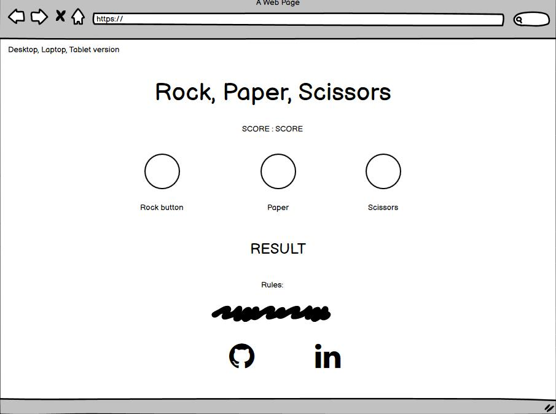
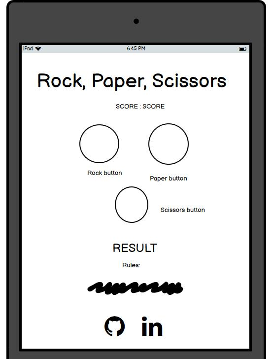
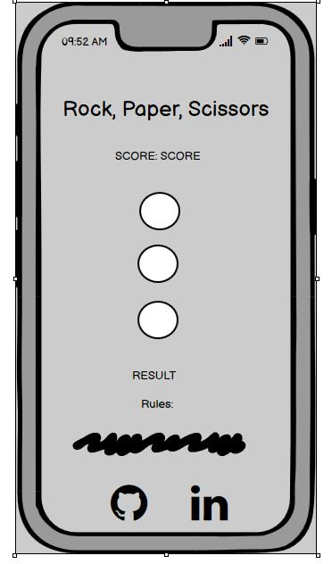
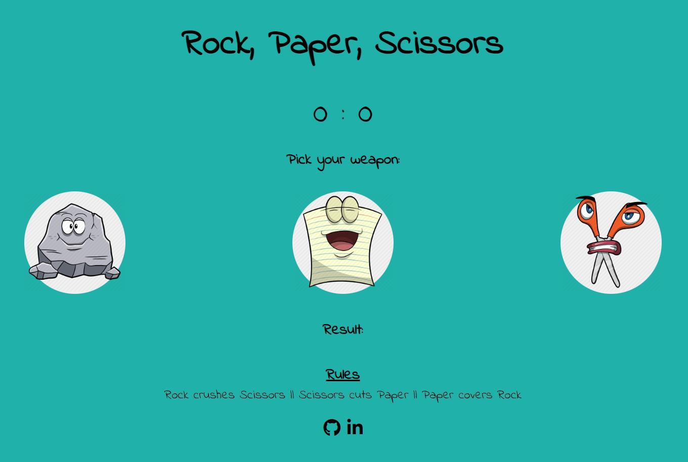
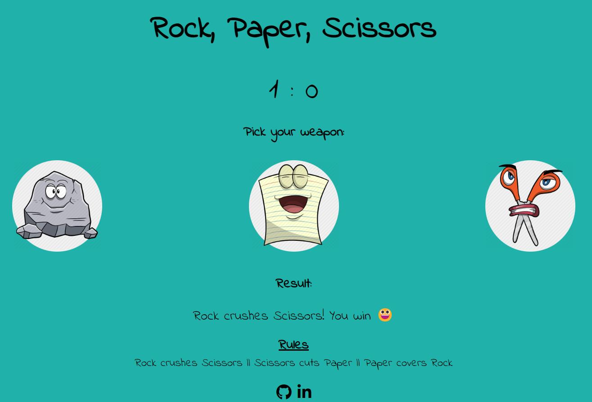
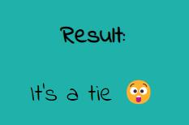
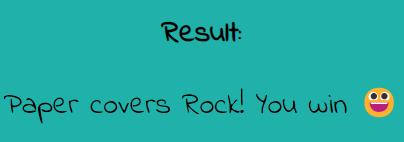
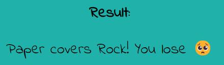
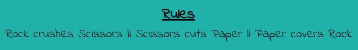

# Rock, Paper, Scissors

With this site, I want to give users the opportunity to play the world-famous game ‘Rock, Paper, Scissors’ and display the score result. The live site can be found [here](https://carinaaj.github.io/p2-rock-paper-scissors/).

# Table of contents
- [Wireframes](#wireframes)
- [Design](#design)
- [Features](#features)
    - [Existing Features](#existing-features)
        - [Landing Page](#landing-page)
        - [Footer](#footer)
- [Testing](#testing)
- [Credits](#credits)

# Wireframes

# Design

**Text & Background color**

To give my white Rock, Paper, Scissors buttons with their white circles a nice contrast, I decided to go with a teal colour. The text color is black, and it works well together with teal. It has been checked with a Contrast Checker (see testing section).

# Features

## Existing Features:

### Landing Page

The landing page shows the user immediately what it is about and gives clear instructions on how to play the game. As I wanted it to be a colorful version, which could also be played by kids, I decided to go with a teal background, a playful font and turned the buttons into comic-style images. To indicate that the images need to be clicked upon, I changed the hover property to a hand.

When starting the game the score above the buttons will be updated accordingly and the result will be displayed in text form below the buttons together with a happy, sad emoji and surprised emoji (depending on the outcome).

 

Below the result display are the rules.

### Footer

The footer section features links to both of my social media sites (Github and LinkedIn) and upon clicking, a new tab will open. As this site doesn't contain a lot of content I decided to center these icons. In order to stay consistent with the colors I also removed the visited color (purple) after the user clicked those and changed it to black. Given it's a simple site I felt it was more aesthetic.

---

## Future Features

- To determine a winner after a set amount of rounds played
- To implement a reset button
- Expand to Rock, Paper, Scissors, Lizard, Spock

# Testing

The site has been tested by friends and family on a variety of mobile devices as well as different web browsers (Chrome, Firefox, Safari), and the game works on all devices. It shows the correct outcome of the game and correctly displays the score to the user.

I faced many challenges during the creation of this project. Whilst I knew which functions I would need (logically), I struggled a lot with how to actually write them out. 

After I set my variables#, the first hurdle I had to overcome was how to set the user and computer score and use it later to compare them with each other and display the result.

Initially, I wanted to do all of this one function, but after a friend pointed out this might not be the most efficient way, I found a simple but effective solution. So I created a separate game function to take the user’s choice as a parameter whilst also nesting the computer’s choice function inside of it (which has been created separately) and adding my displayResult function in it (which takes both the user’s and computer’s choice as a parameter). 

This allowed me to then compare both results and display the result on the screen.

Another big challenge I faced was updating the scores for both parties. At first, I thought it might be an easy fix and simply create two variables for each and assign the value 0 and update it in my displayResult function after the outcome. Unfortunately, it wasn’t as easy as that. 

I then tried the innerHTML property to increment the score with this. However, that also failed as the score still didn’t update. In the end, I found guidance on a YouTube video (credited accordingly in my Credit section), and I was able to make it work. It seemed that my initial approach wasn’t too far off, but I had to create another function separately and still get the innerHTML but setting it either to the user or computer score. So in my displayResult function, I then only had to set incrementing the score where applicable and call the function after incrementing it. 

Due to my prior project, I managed for my HTML and CSS to behave the way I wanted them to, and even the media queries (which had been the biggest challenge in my first project) were a breeze this time. Although I had a slight issue because I haven’t been able to see my social media icons one day, and after pulling my hair out for the good part of half an hour, I noticed they didn’t show because of an Ad Blocker I installed the previous day... Lesson learned :) 

Note: This game has been written with Javascript knowledge I possess at this moment in time. I am, however, aware that there might be more ‘elegant’ and better ways/functions I could use, so I'm planning on revisiting this at a later stage when I have a better and more in-depth grasp of the subject.

## Validator Testing

**JS**

No issues were found through JS Hint

**HTML**

No errors were returned when passing through the official W3C validator

**CSS**

No errors were found when passing through the official (Jigsaw) validator

**Contrast Checker**

The site achieved a pass when running through the contrast checker

**Lighthouse**

The page achieved great performance on mobile and desktop

Mobile:

Desktop:

### Unfixed Bugs

No unfixed bugs have been found.

### Libraries & Programs used:

- Github, to store my repository
- Gitpod, to create my html and css files
- Google Fonts, for my font family 'Indie Flower'
- Font Awesome, for my social media icons 
- Balsamiq, to create my wireframe
- Am I Responsive?
- Dev Tools, to ensure the site looked good across different devices

## Deployment

The site was deployed to GitHub pages. The steps to deploy are as follows:

In the GitHub repository, navigate to the Settings tab. On the left-hand side under ‘Code and automation’, select ‘Pages’ and from the source section drop-down menu, select the Master Branch. Once the master branch has been selected, the page will be automatically refresh with a detailed ribbon display to indicate the successful deployment.
The live link can be found here - 
https://carinaaj.github.io/p2-rock-paper-scissors/

# Credits

**For JavaScript issues I encountered these sites have been used for reference:**

- For general information [W3 Schools ](https://www.w3schools.com/) and [Developer Mozilla](https://developer.mozilla.org/en-US/)
- For guidance I looked at these tutorials on Youtube
- (https://www.youtube.com/watch?v=Qqy8Ov3NWvQ_
- (https://www.youtube.com/watch?v=RwFeg0cEZvQ)
- (https://www.youtube.com/watch?v=qWPtKtYEsN4)
- To assist me with setting the score code has been adapted from (https://www.youtube.com/watch?v=qWPtKtYEsN4)
- For eventListener clarification [Freecodecamp](https://www.freecodecamp.org/news/javascript-addeventlistener-example-code/)

### Media

All images for my Rock, Paper, Scissor buttons have been taken from banners have been taken from https://icon-library.com/

** Additional sites:**

-[HTML Color codes](https://html-color.codes/css/lightseagreen) for my teal background
-[Unicode](https://unicode.org/emoji/charts/full-emoji-list.html#smileys_&_emotion) for my emojis when displaying the result 

I also want to thank a few people who were great support during the creation of this project: my friend [Jessica](https://www.linkedin.com/in/jessica-mowatt-4627a661/), who helped me and nudged me in the right direction when needed, my friend [Jamie](https://www.linkedin.com/in/jamie-king-25938123/), who was there for me during those long hours and whose virtual company kept me sane. 😃

And of course, my mentor [Martina](https://www.linkedin.com/in/martinaterlevic/). I couldn't have asked for a better (and cooler 😎) mentor to have on my side.

Lastly, I wanted to thank my fiancé, Dave Browning, for being an amazing Rubber Duck when I needed one despite being completely unfamiliar with any of this, and who still thinks it's all magic and I'm a wizard. ❤️ 

